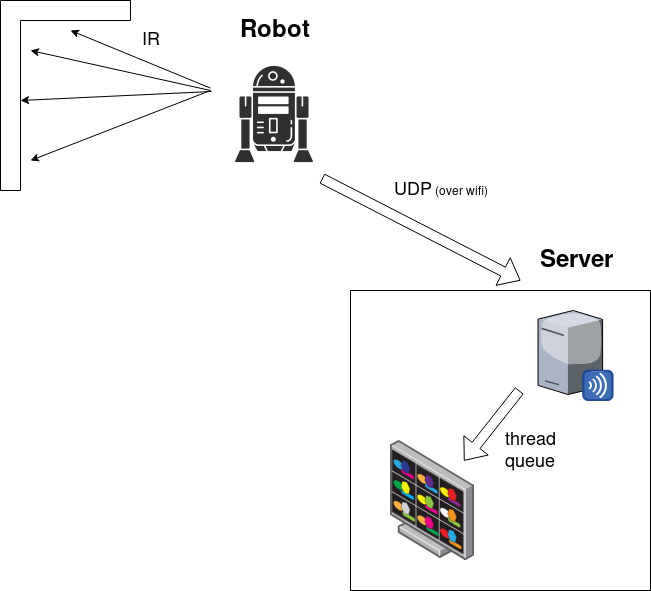

# Mindstorms infrared mapper
It's a LEGO Mindstorms proof-of-concept project for a robot that uses a moving infrared sensor to scan objects within its range.

## Hardware components used:

- 1x EV3 Intelligent Brick
- 2x EV3 Large Servo Motor
- 1x EV3 Medium Servo Motor
- 1x EV3 Infrared Sensor

## Software components:

- [ev3dev-stretch-ev3-generic](https://www.ev3dev.org/downloads/) operating system
- [ev3dev-lang-python](https://github.com/ev3dev/ev3dev-lang-python) library
- pygame (for graphics rendering)
- python sockets (for UDP communication)

## Here's the infrastructure:

## See the robot in action!

[Robot video on Youtube](https://youtu.be/i6X3qB3_FkE)